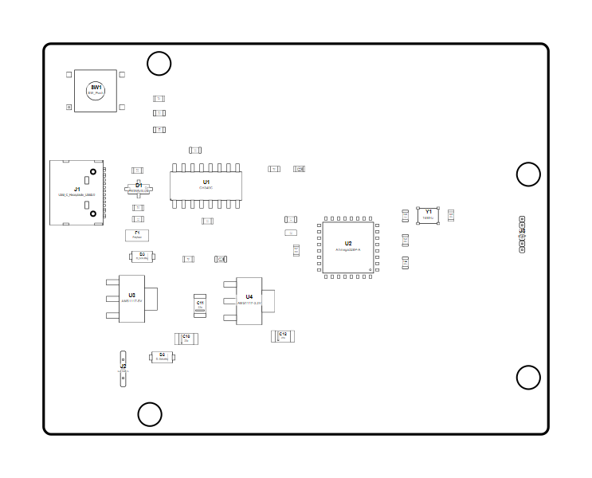

<!-- Generated item page. Full data lives in the source repository. -->
[Catalogue](../../../../../../../README.md) / [OOMP](../../../../../../README.md) / [Project](../../../../../README.md) / [GitHub](../../../../README.md) / [Hanqaqa](../../../README.md) / [Easyduino](../../README.md) / [Atmega328p Arduino Uno](../README.md) / Current

# 🧭 Project hanqaqa/easyduino ATmega328P Arduino Uno current

> Project hanqaqa/easyduino ATmega328P Arduino Uno current is a KiCad project containing 80 extracted component records. The catalogue matcher linked 35 physical placements to OOMP parts.

**[Open board explorer ↗](https://oomlout.github.io/oomp_electronic_verison_5_pretty/catalogue/oomp/project/github/hanqaqa/easyduino/atmega328p_arduino_uno/current/board_explorer.html)** · [Full details →](https://github.com/oomlout/oomp_electronic_version_5/tree/main/parts/oomp_project_github_hanqaqa_easyduino_atmega328p_arduino_uno_current) · [Original project files](https://github.com/Hanqaqa/Easyduino/tree/master/Atmega328p%20Arduino%20Uno)

## At a glance

| Detail | Value |
| --- | --- |
| Components | 80 |
| PCB footprints | 38 |
| Mounting and locating holes | 6 |
| Matched OOMP mounting-hole items | 6 |
| Schematic symbols | 80 |
| Matched OOMP components | 35 |
| Unmatched physical components | 1 |
| Front-side placements | 35 |
| Back-side placements | 1 |
| Project version | current |
| Git ref | master |
| OOMP ID | `oomp_project_github_hanqaqa_easyduino_atmega328p_arduino_uno_current` |

## Catalogue location

`OOMP › Project › GitHub › Hanqaqa › Easyduino › Atmega328p Arduino Uno › Current`

## About this page

This is the compact catalogue view. A detailed source README is available. The [interactive board explorer](https://oomlout.github.io/oomp_electronic_verison_5_pretty/catalogue/oomp/project/github/hanqaqa/easyduino/atmega328p_arduino_uno/current/board_explorer.html) is included as a self-contained HTML page. Schematics, fabrication data, working metadata, alternate diagrams, availability data, and project analysis stay with the [full original record](https://github.com/oomlout/oomp_electronic_version_5/tree/main/parts/oomp_project_github_hanqaqa_easyduino_atmega328p_arduino_uno_current).

---

[↑ Parent category](../README.md) · [Catalogue home](../../../../../../../README.md)
