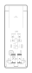

<!-- Generated item page. Full data lives in the source repository. -->
[Catalogue](../../../../../../../README.md) / [OOMP](../../../../../../README.md) / [Project](../../../../../README.md) / [GitHub](../../../../README.md) / [Hanqaqa](../../../README.md) / [Easyduino](../../README.md) / [Esp32s3](../README.md) / Current

# 🧭 Project hanqaqa/easyduino ESP32S3 current

> Project hanqaqa/easyduino ESP32S3 current is a KiCad project containing 77 extracted component records. The catalogue matcher linked 34 physical placements to OOMP parts.

**[Full details →](https://github.com/oomlout/oomp_electronic_version_5/tree/main/parts/oomp_project_github_hanqaqa_easyduino_esp32s3_current)** · [Original project files](https://github.com/Hanqaqa/Easyduino/tree/master/ESP32S3)

## At a glance

| Detail | Value |
| --- | --- |
| Components | 77 |
| PCB footprints | 35 |
| Mounting and locating holes | 4 |
| Matched OOMP mounting-hole items | 4 |
| Schematic symbols | 77 |
| Matched OOMP components | 34 |
| Unmatched physical components | 1 |
| Front-side placements | 35 |
| Back-side placements | 0 |
| Project version | current |
| Git ref | master |
| OOMP ID | `oomp_project_github_hanqaqa_easyduino_esp32s3_current` |

## Catalogue location

`OOMP › Project › GitHub › Hanqaqa › Easyduino › Esp32s3 › Current`

## About this page

This is the compact catalogue view. A detailed source README is available. Schematics, fabrication data, working metadata, alternate diagrams, availability data, and project analysis stay with the [full original record](https://github.com/oomlout/oomp_electronic_version_5/tree/main/parts/oomp_project_github_hanqaqa_easyduino_esp32s3_current).

---

[↑ Parent category](../README.md) · [Catalogue home](../../../../../../../README.md)
