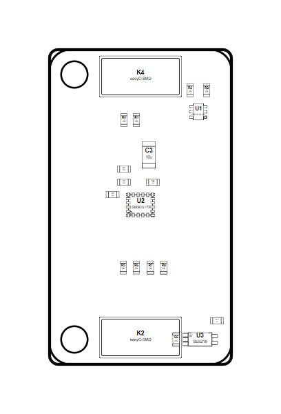

<!-- Generated item page. Full data lives in the source repository. -->
[Catalogue](../../../../../../../README.md) / [OOMP](../../../../../../README.md) / [Project](../../../../../README.md) / [GitHub](../../../../README.md) / [Soldered Electronics](../../../README.md) / [Accelerometer Gyroscope Magnetometer Lsm9 Ds1 Tr Breakout Hardw A569965e](../../README.md) / [Sensor Imu Lsm9ds1tr](../README.md) / Current

# 🧭 Project soldered_electronics/Accelerometer---Gyroscope---Magnetometer-LSM9DS1TR-breakout-hardware-design

> Project soldered_electronics/Accelerometer---Gyroscope---Magnetometer-LSM9DS1TR-breakout-hardware-design LSM9DS1TR IMU current is a KiCad project containing 82 extracted component records. The catalogue matcher linked 24 physical placements to OOMP parts.

**[Open board explorer ↗](https://oomlout.github.io/oomp_electronic_verison_5_pretty/catalogue/oomp/project/github/soldered_electronics/accelerometer_gyroscope_magnetometer_lsm9_ds1_tr_breakout_hardw-a569965e/sensor_imu_lsm9ds1tr/current/board_explorer.html)** · [Full details →](https://github.com/oomlout/oomp_electronic_version_5/tree/main/parts/oomp_project_github_soldered_electronics_accelerometer_gyroscope_magnetometer_lsm9_ds1_tr_breakout_hardware_design_sensor_imu_lsm9ds1tr_current) · [Original project files](https://github.com/SolderedElectronics/Accelerometer---Gyroscope---Magnetometer-LSM9DS1TR-breakout-hardware-design)

## At a glance

| Detail | Value |
| --- | --- |
| Components | 82 |
| PCB footprints | 71 |
| Mounting and locating holes | 2 |
| Matched OOMP mounting-hole items | 2 |
| Schematic symbols | 52 |
| Matched OOMP components | 24 |
| Unmatched physical components | 0 |
| Front-side placements | 20 |
| Back-side placements | 2 |
| Project version | current |
| Git ref | main |
| OOMP ID | `oomp_project_github_soldered_electronics_accelerometer_gyroscope_magnetometer_lsm9_ds1_tr_breakout_hardware_design_sensor_imu_lsm9ds1tr_current` |

## Catalogue location

`OOMP › Project › GitHub › Soldered Electronics › Accelerometer Gyroscope Magnetometer Lsm9 Ds1 Tr Breakout Hardw A569965e › Sensor Imu Lsm9ds1tr › Current`

## About this page

This is the compact catalogue view. A detailed source README is available. The [interactive board explorer](https://oomlout.github.io/oomp_electronic_verison_5_pretty/catalogue/oomp/project/github/soldered_electronics/accelerometer_gyroscope_magnetometer_lsm9_ds1_tr_breakout_hardw-a569965e/sensor_imu_lsm9ds1tr/current/board_explorer.html) is included as a self-contained HTML page. Schematics, fabrication data, working metadata, alternate diagrams, availability data, and project analysis stay with the [full original record](https://github.com/oomlout/oomp_electronic_version_5/tree/main/parts/oomp_project_github_soldered_electronics_accelerometer_gyroscope_magnetometer_lsm9_ds1_tr_breakout_hardware_design_sensor_imu_lsm9ds1tr_current).

---

[↑ Parent category](../README.md) · [Catalogue home](../../../../../../../README.md)
