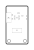

<!-- Generated item page. Full data lives in the source repository. -->
[Catalogue](../../../../../../../README.md) / [OOMP](../../../../../../README.md) / [Project](../../../../../README.md) / [GitHub](../../../../README.md) / [Soldered Electronics](../../../README.md) / [Air Quality Sensor Mq135 Breakout Hardware Design](../../README.md) / [Sensor Gas Mq135 Breakout](../README.md) / Current

# 🧭 Project soldered_electronics/Air-quality-sensor-MQ135-breakout-hardware-design

> Project soldered_electronics/Air-quality-sensor-MQ135-breakout-hardware-design MQ135 Breakout current is a KiCad project containing 49 extracted component records. The catalogue matcher linked 12 physical placements to OOMP parts.

**[Full details →](https://github.com/oomlout/oomp_electronic_version_5/tree/main/parts/oomp_project_github_soldered_electronics_air_quality_sensor_mq135_breakout_hardware_design_sensor_gas_mq135_breakout_current)** · [Original project files](https://github.com/SolderedElectronics/Air-quality-sensor-MQ135-breakout-hardware-design)

## At a glance

| Detail | Value |
| --- | --- |
| Components | 49 |
| PCB footprints | 39 |
| Mounting and locating holes | 2 |
| Matched OOMP mounting-hole items | 2 |
| Schematic symbols | 26 |
| Matched OOMP components | 12 |
| Unmatched physical components | 0 |
| Front-side placements | 9 |
| Back-side placements | 1 |
| Project version | current |
| Git ref | main |
| OOMP ID | `oomp_project_github_soldered_electronics_air_quality_sensor_mq135_breakout_hardware_design_sensor_gas_mq135_breakout_current` |

## Catalogue location

`OOMP › Project › GitHub › Soldered Electronics › Air Quality Sensor Mq135 Breakout Hardware Design › Sensor Gas Mq135 Breakout › Current`

## About this page

This is the compact catalogue view. A detailed source README is available. Schematics, fabrication data, working metadata, alternate diagrams, availability data, and project analysis stay with the [full original record](https://github.com/oomlout/oomp_electronic_version_5/tree/main/parts/oomp_project_github_soldered_electronics_air_quality_sensor_mq135_breakout_hardware_design_sensor_gas_mq135_breakout_current).

---

[↑ Parent category](../README.md) · [Catalogue home](../../../../../../../README.md)
