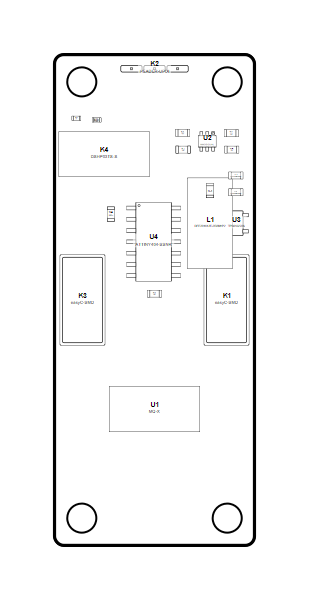

<!-- Generated item page. Full data lives in the source repository. -->
[Catalogue](../../../../../../../README.md) / [OOMP](../../../../../../README.md) / [Project](../../../../../README.md) / [GitHub](../../../../README.md) / [Soldered Electronics](../../../README.md) / [Co Flammable Gasses Sensor Mq9 Breakout With Easy C Hardware Design](../../README.md) / [Sensor Gas Mq9 Easyc](../README.md) / Current

# 🧭 Project soldered_electronics/CO--flammable-gasses-sensor-MQ9-breakout-with-easyC-hardware-design

> Project soldered_electronics/CO--flammable-gasses-sensor-MQ9-breakout-with-easyC-hardware-design MQ9 Breakout easyC current is a KiCad project containing 74 extracted component records. The catalogue matcher linked 24 physical placements to OOMP parts.

**[Open board explorer ↗](https://oomlout.github.io/oomp_electronic_verison_5_pretty/catalogue/oomp/project/github/soldered_electronics/co_flammable_gasses_sensor_mq9_breakout_with_easy_c_hardware_design/sensor_gas_mq9_easyc/current/board_explorer.html)** · [Full details →](https://github.com/oomlout/oomp_electronic_version_5/tree/main/parts/oomp_project_github_soldered_electronics_co_flammable_gasses_sensor_mq9_breakout_with_easy_c_hardware_design_sensor_gas_mq9_easyc_current) · [Original project files](https://github.com/SolderedElectronics/CO--flammable-gasses-sensor-MQ9-breakout-with-easyC-hardware-design)

## At a glance

| Detail | Value |
| --- | --- |
| Components | 74 |
| PCB footprints | 58 |
| Mounting and locating holes | 4 |
| Matched OOMP mounting-hole items | 4 |
| Schematic symbols | 49 |
| Matched OOMP components | 24 |
| Unmatched physical components | 0 |
| Front-side placements | 20 |
| Back-side placements | 0 |
| Project version | current |
| Git ref | main |
| OOMP ID | `oomp_project_github_soldered_electronics_co_flammable_gasses_sensor_mq9_breakout_with_easy_c_hardware_design_sensor_gas_mq9_easyc_current` |

## Catalogue location

`OOMP › Project › GitHub › Soldered Electronics › Co Flammable Gasses Sensor Mq9 Breakout With Easy C Hardware Design › Sensor Gas Mq9 Easyc › Current`

## About this page

This is the compact catalogue view. A detailed source README is available. The [interactive board explorer](https://oomlout.github.io/oomp_electronic_verison_5_pretty/catalogue/oomp/project/github/soldered_electronics/co_flammable_gasses_sensor_mq9_breakout_with_easy_c_hardware_design/sensor_gas_mq9_easyc/current/board_explorer.html) is included as a self-contained HTML page. Schematics, fabrication data, working metadata, alternate diagrams, availability data, and project analysis stay with the [full original record](https://github.com/oomlout/oomp_electronic_version_5/tree/main/parts/oomp_project_github_soldered_electronics_co_flammable_gasses_sensor_mq9_breakout_with_easy_c_hardware_design_sensor_gas_mq9_easyc_current).

---

[↑ Parent category](../README.md) · [Catalogue home](../../../../../../../README.md)
