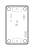

<!-- Generated item page. Full data lives in the source repository. -->
[Catalogue](../../../../../../../README.md) / [OOMP](../../../../../../README.md) / [Project](../../../../../README.md) / [GitHub](../../../../README.md) / [Soldered Electronics](../../../README.md) / [Digital Light Proximity Sensor Ltr 507 Als Breakout Hardware Design](../../README.md) / [Sensor Light Ltr507als](../README.md) / Current

# 🧭 Project soldered_electronics/Digital-light---proximity-sensor-LTR-507ALS-breakout-hardware-design

> Project soldered_electronics/Digital-light---proximity-sensor-LTR-507ALS-breakout-hardware-design LTR-507ALS Breakout current is a KiCad project containing 70 extracted component records. The catalogue matcher linked 20 physical placements to OOMP parts.

**[Full details →](https://github.com/oomlout/oomp_electronic_version_5/tree/main/parts/oomp_project_github_soldered_electronics_digital_light_proximity_sensor_ltr_507_als_breakout_hardware_design_sensor_light_ltr507als_current)** · [Original project files](https://github.com/SolderedElectronics/Digital-light---proximity-sensor-LTR-507ALS-breakout-hardware-design)

## At a glance

| Detail | Value |
| --- | --- |
| Components | 70 |
| PCB footprints | 56 |
| Mounting and locating holes | 4 |
| Matched OOMP mounting-hole items | 4 |
| Schematic symbols | 46 |
| Matched OOMP components | 20 |
| Unmatched physical components | 0 |
| Front-side placements | 14 |
| Back-side placements | 2 |
| Project version | current |
| Git ref | main |
| OOMP ID | `oomp_project_github_soldered_electronics_digital_light_proximity_sensor_ltr_507_als_breakout_hardware_design_sensor_light_ltr507als_current` |

## Catalogue location

`OOMP › Project › GitHub › Soldered Electronics › Digital Light Proximity Sensor Ltr 507 Als Breakout Hardware Design › Sensor Light Ltr507als › Current`

## About this page

This is the compact catalogue view. A detailed source README is available. Schematics, fabrication data, working metadata, alternate diagrams, availability data, and project analysis stay with the [full original record](https://github.com/oomlout/oomp_electronic_version_5/tree/main/parts/oomp_project_github_soldered_electronics_digital_light_proximity_sensor_ltr_507_als_breakout_hardware_design_sensor_light_ltr507als_current).

---

[↑ Parent category](../README.md) · [Catalogue home](../../../../../../../README.md)
