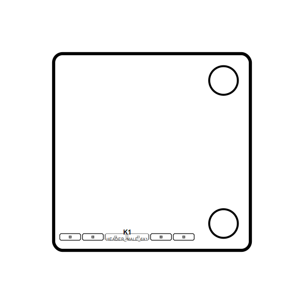

<!-- Generated item page. Full data lives in the source repository. -->
[Catalogue](../../../../../../../README.md) / [OOMP](../../../../../../README.md) / [Project](../../../../../README.md) / [GitHub](../../../../README.md) / [Soldered Electronics](../../../README.md) / [Pms7003 Sensor Adapter Hardware Design](../../README.md) / [Sensor Pms7003 Adapter](../README.md) / Current

# 🧭 Project soldered_electronics/PMS7003-sensor-adapter-hardware-design PMS7003

> Project soldered_electronics/PMS7003-sensor-adapter-hardware-design PMS7003 Adapter current is a KiCad project containing 37 extracted component records. The catalogue matcher linked 9 physical placements to OOMP parts.

**[Open board explorer ↗](https://html-preview.github.io/?url=https://github.com/oomlout/oomp_electronic_verison_5_pretty/blob/main/catalogue/oomp/project/github/soldered_electronics/pms7003_sensor_adapter_hardware_design/sensor_pms7003_adapter/current/board_explorer.html)** · [HTML file](board_explorer.html) · [Full details →](https://github.com/oomlout/oomp_electronic_version_5/tree/main/parts/oomp_project_github_soldered_electronics_pms7003_sensor_adapter_hardware_design_sensor_pms7003_adapter_current) · [Original project files](https://github.com/SolderedElectronics/PMS7003-sensor-adapter-hardware-design)

## At a glance

| Detail | Value |
| --- | --- |
| Components | 37 |
| PCB footprints | 28 |
| Mounting and locating holes | 2 |
| Matched OOMP mounting-hole items | 2 |
| Schematic symbols | 21 |
| Matched OOMP components | 9 |
| Unmatched physical components | 0 |
| Front-side placements | 1 |
| Back-side placements | 6 |
| Project version | current |
| Git ref | main |
| OOMP ID | `oomp_project_github_soldered_electronics_pms7003_sensor_adapter_hardware_design_sensor_pms7003_adapter_current` |

## Catalogue location

`OOMP › Project › GitHub › Soldered Electronics › Pms7003 Sensor Adapter Hardware Design › Sensor Pms7003 Adapter › Current`

## About this page

This is the compact catalogue view. A detailed source README is available. The [interactive board explorer](https://html-preview.github.io/?url=https://github.com/oomlout/oomp_electronic_verison_5_pretty/blob/main/catalogue/oomp/project/github/soldered_electronics/pms7003_sensor_adapter_hardware_design/sensor_pms7003_adapter/current/board_explorer.html) is included as a self-contained HTML page. Schematics, fabrication data, working metadata, alternate diagrams, availability data, and project analysis stay with the [full original record](https://github.com/oomlout/oomp_electronic_version_5/tree/main/parts/oomp_project_github_soldered_electronics_pms7003_sensor_adapter_hardware_design_sensor_pms7003_adapter_current).

---

[↑ Parent category](../README.md) · [Catalogue home](../../../../../../../README.md)
