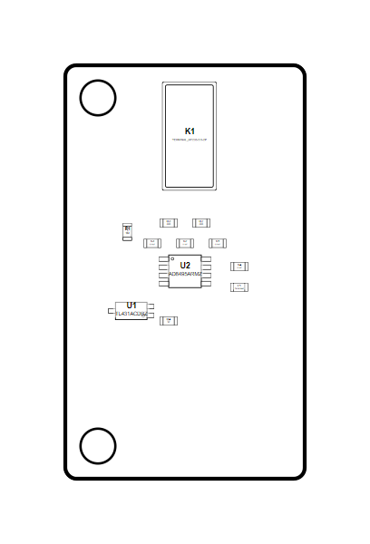

<!-- Generated item page. Full data lives in the source repository. -->
[Catalogue](../../../../../../../README.md) / [OOMP](../../../../../../README.md) / [Project](../../../../../README.md) / [GitHub](../../../../README.md) / [Soldered Electronics](../../../README.md) / [Thermocouple Sensor Ad8495 Breakout Hardware Design](../../README.md) / [Sensor Thermocouple Ad8495](../README.md) / Current

# 🧭 Project soldered_electronics/Thermocouple-sensor-AD8495-breakout-hardware-design

> Project soldered_electronics/Thermocouple-sensor-AD8495-breakout-hardware-design AD8495 Breakout current is a KiCad project containing 35 extracted component records. The catalogue matcher linked 15 physical placements to OOMP parts.

**[Open board explorer ↗](https://html-preview.github.io/?url=https://github.com/oomlout/oomp_electronic_verison_5_pretty/blob/main/catalogue/oomp/project/github/soldered_electronics/thermocouple_sensor_ad8495_breakout_hardware_design/sensor_thermocouple_ad8495/current/board_explorer.html)** · [HTML file](board_explorer.html) · [Full details →](https://github.com/oomlout/oomp_electronic_version_5/tree/main/parts/oomp_project_github_soldered_electronics_thermocouple_sensor_ad8495_breakout_hardware_design_sensor_thermocouple_ad8495_current) · [Original project files](https://github.com/SolderedElectronics/Thermocouple-sensor-AD8495-breakout-hardware-design)

## At a glance

| Detail | Value |
| --- | --- |
| Components | 35 |
| PCB footprints | 26 |
| Mounting and locating holes | 2 |
| Matched OOMP mounting-hole items | 2 |
| Schematic symbols | 26 |
| Matched OOMP components | 15 |
| Unmatched physical components | 0 |
| Front-side placements | 12 |
| Back-side placements | 1 |
| Project version | current |
| Git ref | main |
| OOMP ID | `oomp_project_github_soldered_electronics_thermocouple_sensor_ad8495_breakout_hardware_design_sensor_thermocouple_ad8495_current` |

## Catalogue location

`OOMP › Project › GitHub › Soldered Electronics › Thermocouple Sensor Ad8495 Breakout Hardware Design › Sensor Thermocouple Ad8495 › Current`

## About this page

This is the compact catalogue view. A detailed source README is available. The [interactive board explorer](https://html-preview.github.io/?url=https://github.com/oomlout/oomp_electronic_verison_5_pretty/blob/main/catalogue/oomp/project/github/soldered_electronics/thermocouple_sensor_ad8495_breakout_hardware_design/sensor_thermocouple_ad8495/current/board_explorer.html) is included as a self-contained HTML page. Schematics, fabrication data, working metadata, alternate diagrams, availability data, and project analysis stay with the [full original record](https://github.com/oomlout/oomp_electronic_version_5/tree/main/parts/oomp_project_github_soldered_electronics_thermocouple_sensor_ad8495_breakout_hardware_design_sensor_thermocouple_ad8495_current).

---

[↑ Parent category](../README.md) · [Catalogue home](../../../../../../../README.md)
