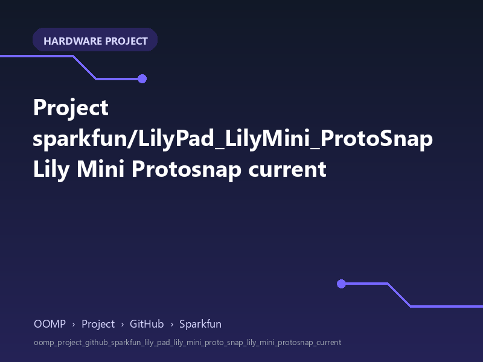

<!-- Generated item page. Full data lives in the source repository. -->
[Catalogue](../../../../../../../README.md) / [OOMP](../../../../../../README.md) / [Project](../../../../../README.md) / [GitHub](../../../../README.md) / [Sparkfun](../../../README.md) / [Lily Pad Lily Mini Proto Snap](../../README.md) / [Lily Mini Protosnap](../README.md) / Current

# 🧭 Project sparkfun/LilyPad_LilyMini_ProtoSnap Lily Mini Protosnap current

> A concise OOMP hardware project organised under OOMP › Project › GitHub › Sparkfun.

**[Open board explorer ↗](https://html-preview.github.io/?url=https://github.com/oomlout/oomp_electronic_verison_5_pretty/blob/main/catalogue/oomp/project/github/sparkfun/lily_pad_lily_mini_proto_snap/lily_mini_protosnap/current/board_explorer.html)** · [HTML file](board_explorer.html) · [Full details →](https://github.com/oomlout/oomp_electronic_version_5/tree/main/parts/oomp_project_github_sparkfun_lily_pad_lily_mini_proto_snap_lily_mini_protosnap_current) · [Original project files](https://github.com/sparkfun/LilyPad_LilyMini_ProtoSnap/blob/master/Hardware/LilyMini_Protosnap.brd)

## At a glance

| Detail | Value |
| --- | --- |
| Owner | sparkfun |
| Repository | LilyPad_LilyMini_ProtoSnap |
| Board | Lily Mini Protosnap |
| Source format | eagle |
| Version | current |
| Git ref | master |
| OOMP ID | `oomp_project_github_sparkfun_lily_pad_lily_mini_proto_snap_lily_mini_protosnap_current` |

## Catalogue location

`OOMP › Project › GitHub › Sparkfun › Lily Pad Lily Mini Proto Snap › Lily Mini Protosnap › Current`

## About this page

This is the compact catalogue view. This index entry was built directly from its working metadata. The [board explorer page](https://html-preview.github.io/?url=https://github.com/oomlout/oomp_electronic_verison_5_pretty/blob/main/catalogue/oomp/project/github/sparkfun/lily_pad_lily_mini_proto_snap/lily_mini_protosnap/current/board_explorer.html) currently shows the project preview and source links; interactive board geometry will appear after the source project has been processed. Schematics, fabrication data, working metadata, alternate diagrams, availability data, and project analysis stay with the [full original record](https://github.com/oomlout/oomp_electronic_version_5/tree/main/parts/oomp_project_github_sparkfun_lily_pad_lily_mini_proto_snap_lily_mini_protosnap_current).

---

[↑ Parent category](../README.md) · [Catalogue home](../../../../../../../README.md)
