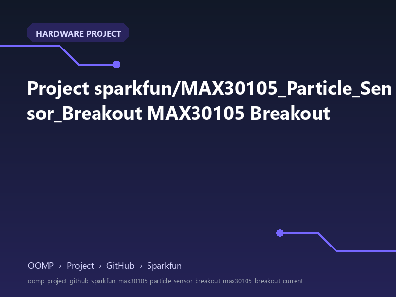

<!-- Generated item page. Full data lives in the source repository. -->
[Catalogue](../../../../../../../README.md) / [OOMP](../../../../../../README.md) / [Project](../../../../../README.md) / [GitHub](../../../../README.md) / [Sparkfun](../../../README.md) / [Max30105 Particle Sensor Breakout](../../README.md) / [Max30105 Breakout](../README.md) / Current

# 🧭 Project sparkfun/MAX30105_Particle_Sensor_Breakout MAX30105 Breakout

> A concise OOMP hardware project organised under OOMP › Project › GitHub › Sparkfun.

**[Open board explorer ↗](https://html-preview.github.io/?url=https://github.com/oomlout/oomp_electronic_verison_5_pretty/blob/main/catalogue/oomp/project/github/sparkfun/max30105_particle_sensor_breakout/max30105_breakout/current/board_explorer.html)** · [HTML file](board_explorer.html) · [Full details →](https://github.com/oomlout/oomp_electronic_version_5/tree/main/parts/oomp_project_github_sparkfun_max30105_particle_sensor_breakout_max30105_breakout_current) · [Original project files](https://github.com/sparkfun/MAX30105_Particle_Sensor_Breakout/blob/master/Hardware/MAX30105_Breakout.brd)

## At a glance

| Detail | Value |
| --- | --- |
| Owner | sparkfun |
| Repository | MAX30105_Particle_Sensor_Breakout |
| Board | MAX30105 Breakout |
| Source format | eagle |
| Version | current |
| Git ref | master |
| OOMP ID | `oomp_project_github_sparkfun_max30105_particle_sensor_breakout_max30105_breakout_current` |

## Catalogue location

`OOMP › Project › GitHub › Sparkfun › Max30105 Particle Sensor Breakout › Max30105 Breakout › Current`

## About this page

This is the compact catalogue view. This index entry was built directly from its working metadata. The [board explorer page](https://html-preview.github.io/?url=https://github.com/oomlout/oomp_electronic_verison_5_pretty/blob/main/catalogue/oomp/project/github/sparkfun/max30105_particle_sensor_breakout/max30105_breakout/current/board_explorer.html) currently shows the project preview and source links; interactive board geometry will appear after the source project has been processed. Schematics, fabrication data, working metadata, alternate diagrams, availability data, and project analysis stay with the [full original record](https://github.com/oomlout/oomp_electronic_version_5/tree/main/parts/oomp_project_github_sparkfun_max30105_particle_sensor_breakout_max30105_breakout_current).

---

[↑ Parent category](../README.md) · [Catalogue home](../../../../../../../README.md)
