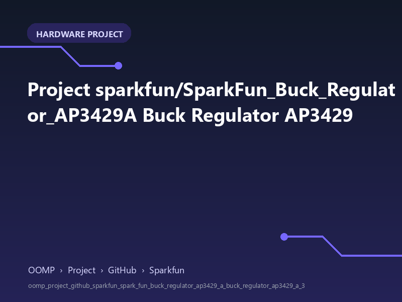

<!-- Generated item page. Full data lives in the source repository. -->
[Catalogue](../../../../../../../README.md) / [OOMP](../../../../../../README.md) / [Project](../../../../../README.md) / [GitHub](../../../../README.md) / [Sparkfun](../../../README.md) / [Spark Fun Buck Regulator Ap3429 A](../../README.md) / [Buck Regulator Ap3429 A 3 V3](../README.md) / Current

# 🧭 Project sparkfun/SparkFun_Buck_Regulator_AP3429A Buck Regulator AP3429

> A concise OOMP hardware project organised under OOMP › Project › GitHub › Sparkfun.

**[Open board explorer ↗](https://oomlout.github.io/oomp_electronic_verison_5_pretty/catalogue/oomp/project/github/sparkfun/spark_fun_buck_regulator_ap3429_a/buck_regulator_ap3429_a_3_v3/current/board_explorer.html)** · [Full details →](https://github.com/oomlout/oomp_electronic_version_5/tree/main/parts/oomp_project_github_sparkfun_spark_fun_buck_regulator_ap3429_a_buck_regulator_ap3429_a_3_v3_current) · [Original project files](https://github.com/sparkfun/SparkFun_Buck_Regulator_AP3429A/blob/main/Hardware/Buck_Regulator_AP3429A_3V3/Buck_Regulator_AP3429A_3V3.brd)

## At a glance

| Detail | Value |
| --- | --- |
| Owner | sparkfun |
| Repository | SparkFun_Buck_Regulator_AP3429A |
| Board | Buck Regulator AP3429 A 3 V3 |
| Source format | eagle |
| Version | current |
| Git ref | main |
| OOMP ID | `oomp_project_github_sparkfun_spark_fun_buck_regulator_ap3429_a_buck_regulator_ap3429_a_3_v3_current` |

## Catalogue location

`OOMP › Project › GitHub › Sparkfun › Spark Fun Buck Regulator Ap3429 A › Buck Regulator Ap3429 A 3 V3 › Current`

## About this page

This is the compact catalogue view. This index entry was built directly from its working metadata. The [board explorer page](https://oomlout.github.io/oomp_electronic_verison_5_pretty/catalogue/oomp/project/github/sparkfun/spark_fun_buck_regulator_ap3429_a/buck_regulator_ap3429_a_3_v3/current/board_explorer.html) currently shows the project preview and source links; interactive board geometry will appear after the source project has been processed. Schematics, fabrication data, working metadata, alternate diagrams, availability data, and project analysis stay with the [full original record](https://github.com/oomlout/oomp_electronic_version_5/tree/main/parts/oomp_project_github_sparkfun_spark_fun_buck_regulator_ap3429_a_buck_regulator_ap3429_a_3_v3_current).

---

[↑ Parent category](../README.md) · [Catalogue home](../../../../../../../README.md)
