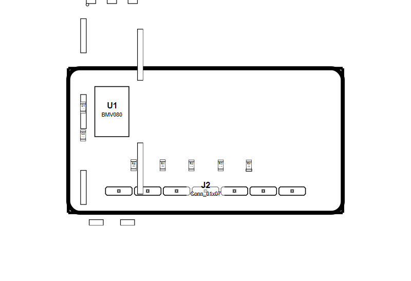

<!-- Generated item page. Full data lives in the source repository. -->
[Catalogue](../../../../../../../README.md) / [OOMP](../../../../../../README.md) / [Project](../../../../../README.md) / [GitHub](../../../../README.md) / [Sparkfun](../../../README.md) / [Spark Fun Particulate Matter Sensor Breakout Bmv080](../../README.md) / [Particulate Matter Bmv080](../README.md) / Current

# 🧭 Project sparkfun/SparkFun_Particulate_Matter_Sensor_Breakout_BMV080 Particulate

> Project sparkfun/SparkFun_Particulate_Matter_Sensor_Breakout_BMV080 Particulate Matter Sensor BMV080 current is a KiCad project containing 74 extracted component records. The catalogue matcher linked 13 physical placements to OOMP parts.

**[Open board explorer ↗](https://oomlout.github.io/oomp_electronic_verison_5_pretty/catalogue/oomp/project/github/sparkfun/spark_fun_particulate_matter_sensor_breakout_bmv080/particulate_matter_bmv080/current/board_explorer.html)** · [Full details →](https://github.com/oomlout/oomp_electronic_version_5/tree/main/parts/oomp_project_github_sparkfun_spark_fun_particulate_matter_sensor_breakout_bmv080_particulate_matter_bmv080_current) · [Original project files](https://github.com/sparkfun/SparkFun_Particulate_Matter_Sensor_Breakout_BMV080)

## At a glance

| Detail | Value |
| --- | --- |
| Components | 74 |
| PCB footprints | 55 |
| Mounting and locating holes | 0 |
| Matched OOMP mounting-hole items | 0 |
| Schematic symbols | 47 |
| Matched OOMP components | 13 |
| Unmatched physical components | 0 |
| Front-side placements | 9 |
| Back-side placements | 4 |
| Project version | current |
| Git ref | main |
| OOMP ID | `oomp_project_github_sparkfun_spark_fun_particulate_matter_sensor_breakout_bmv080_particulate_matter_bmv080_current` |

## Catalogue location

`OOMP › Project › GitHub › Sparkfun › Spark Fun Particulate Matter Sensor Breakout Bmv080 › Particulate Matter Bmv080 › Current`

## About this page

This is the compact catalogue view. A detailed source README is available. The [interactive board explorer](https://oomlout.github.io/oomp_electronic_verison_5_pretty/catalogue/oomp/project/github/sparkfun/spark_fun_particulate_matter_sensor_breakout_bmv080/particulate_matter_bmv080/current/board_explorer.html) is included as a self-contained HTML page. Schematics, fabrication data, working metadata, alternate diagrams, availability data, and project analysis stay with the [full original record](https://github.com/oomlout/oomp_electronic_version_5/tree/main/parts/oomp_project_github_sparkfun_spark_fun_particulate_matter_sensor_breakout_bmv080_particulate_matter_bmv080_current).

---

[↑ Parent category](../README.md) · [Catalogue home](../../../../../../../README.md)
