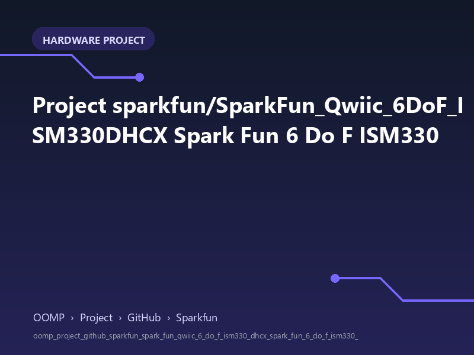

<!-- Generated item page. Full data lives in the source repository. -->
[Catalogue](../../../../../../../README.md) / [OOMP](../../../../../../README.md) / [Project](../../../../../README.md) / [GitHub](../../../../README.md) / [Sparkfun](../../../README.md) / [Spark Fun Qwiic 6 Do F Ism330 Dhcx](../../README.md) / [Spark Fun 6 Do F Ism330 Dhcx Qwiic Micro](../README.md) / Current

# 🧭 Project sparkfun/SparkFun_Qwiic_6DoF_ISM330DHCX Spark Fun 6 Do F ISM330

> A concise OOMP hardware project organised under OOMP › Project › GitHub › Sparkfun.

**[Open board explorer ↗](https://html-preview.github.io/?url=https://github.com/oomlout/oomp_electronic_verison_5_pretty/blob/main/catalogue/oomp/project/github/sparkfun/spark_fun_qwiic_6_do_f_ism330_dhcx/spark_fun_6_do_f_ism330_dhcx_qwiic_micro/current/board_explorer.html)** · [HTML file](board_explorer.html) · [Full details →](https://github.com/oomlout/oomp_electronic_version_5/tree/main/parts/oomp_project_github_sparkfun_spark_fun_qwiic_6_do_f_ism330_dhcx_spark_fun_6_do_f_ism330_dhcx_qwiic_micro_current) · [Original project files](https://github.com/sparkfun/SparkFun_Qwiic_6DoF_ISM330DHCX/blob/main/Hardware/Qwiic%20Micro/SparkFun_6DoF_ISM330DHCX_Qwiic_Micro.brd)

## At a glance

| Detail | Value |
| --- | --- |
| Owner | sparkfun |
| Repository | SparkFun_Qwiic_6DoF_ISM330DHCX |
| Board | Spark Fun 6 Do F ISM330 DHCX Qwiic Micro |
| Source format | eagle |
| Version | current |
| Git ref | main |
| OOMP ID | `oomp_project_github_sparkfun_spark_fun_qwiic_6_do_f_ism330_dhcx_spark_fun_6_do_f_ism330_dhcx_qwiic_micro_current` |

## Catalogue location

`OOMP › Project › GitHub › Sparkfun › Spark Fun Qwiic 6 Do F Ism330 Dhcx › Spark Fun 6 Do F Ism330 Dhcx Qwiic Micro › Current`

## About this page

This is the compact catalogue view. This index entry was built directly from its working metadata. The [board explorer page](https://html-preview.github.io/?url=https://github.com/oomlout/oomp_electronic_verison_5_pretty/blob/main/catalogue/oomp/project/github/sparkfun/spark_fun_qwiic_6_do_f_ism330_dhcx/spark_fun_6_do_f_ism330_dhcx_qwiic_micro/current/board_explorer.html) currently shows the project preview and source links; interactive board geometry will appear after the source project has been processed. Schematics, fabrication data, working metadata, alternate diagrams, availability data, and project analysis stay with the [full original record](https://github.com/oomlout/oomp_electronic_version_5/tree/main/parts/oomp_project_github_sparkfun_spark_fun_qwiic_6_do_f_ism330_dhcx_spark_fun_6_do_f_ism330_dhcx_qwiic_micro_current).

---

[↑ Parent category](../README.md) · [Catalogue home](../../../../../../../README.md)
