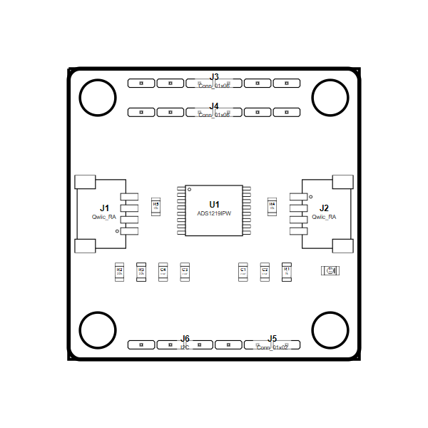

<!-- Generated item page. Full data lives in the source repository. -->
[Catalogue](../../../../../../../README.md) / [OOMP](../../../../../../README.md) / [Project](../../../../../README.md) / [GitHub](../../../../README.md) / [Sparkfun](../../../README.md) / [Spark Fun Qwiic Adc Ads1219](../../README.md) / [Qwiic Adc Ads1219](../README.md) / Current

# 🧭 Project sparkfun/SparkFun_Qwiic_ADC_ADS1219 Qwiic ADC ADS1219 current

> Project sparkfun/SparkFun_Qwiic_ADC_ADS1219 Qwiic ADC ADS1219 current is a KiCad project containing 104 extracted component records. The catalogue matcher linked 21 physical placements to OOMP parts.

**[Open board explorer ↗](https://oomlout.github.io/oomp_electronic_verison_5_pretty/catalogue/oomp/project/github/sparkfun/spark_fun_qwiic_adc_ads1219/qwiic_adc_ads1219/current/board_explorer.html)** · [Full details →](https://github.com/oomlout/oomp_electronic_version_5/tree/main/parts/oomp_project_github_sparkfun_spark_fun_qwiic_adc_ads1219_qwiic_adc_ads1219_current) · [Original project files](https://github.com/sparkfun/SparkFun_Qwiic_ADC_ADS1219)

## At a glance

| Detail | Value |
| --- | --- |
| Components | 104 |
| PCB footprints | 77 |
| Mounting and locating holes | 4 |
| Matched OOMP mounting-hole items | 4 |
| Schematic symbols | 66 |
| Matched OOMP components | 21 |
| Unmatched physical components | 0 |
| Front-side placements | 17 |
| Back-side placements | 0 |
| Project version | current |
| Git ref | main |
| OOMP ID | `oomp_project_github_sparkfun_spark_fun_qwiic_adc_ads1219_qwiic_adc_ads1219_current` |

## Catalogue location

`OOMP › Project › GitHub › Sparkfun › Spark Fun Qwiic Adc Ads1219 › Qwiic Adc Ads1219 › Current`

## About this page

This is the compact catalogue view. A detailed source README is available. The [interactive board explorer](https://oomlout.github.io/oomp_electronic_verison_5_pretty/catalogue/oomp/project/github/sparkfun/spark_fun_qwiic_adc_ads1219/qwiic_adc_ads1219/current/board_explorer.html) is included as a self-contained HTML page. Schematics, fabrication data, working metadata, alternate diagrams, availability data, and project analysis stay with the [full original record](https://github.com/oomlout/oomp_electronic_version_5/tree/main/parts/oomp_project_github_sparkfun_spark_fun_qwiic_adc_ads1219_qwiic_adc_ads1219_current).

---

[↑ Parent category](../README.md) · [Catalogue home](../../../../../../../README.md)
