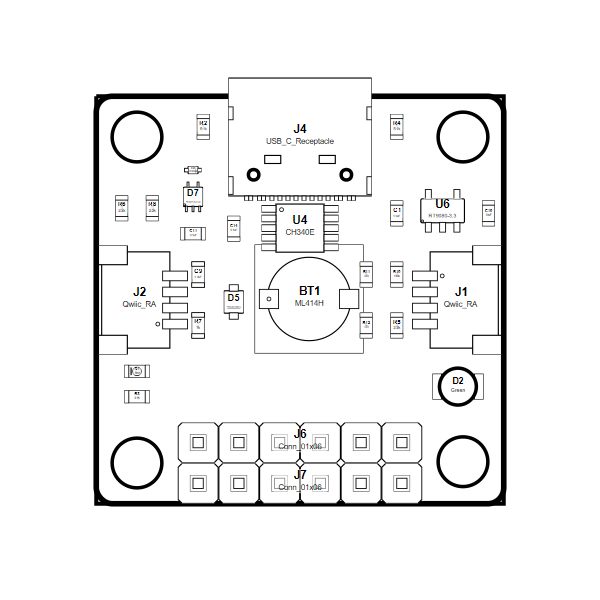

<!-- Generated item page. Full data lives in the source repository. -->
[Catalogue](../../../../../../../README.md) / [OOMP](../../../../../../README.md) / [Project](../../../../../README.md) / [GitHub](../../../../README.md) / [Sparkfun](../../../README.md) / [Spark Fun Qwiic Gnss Sam M8 Q](../../README.md) / [Qwiic Gnss Sam M8q](../README.md) / V0 1

# 🧭 Project sparkfun/SparkFun_Qwiic_GNSS_SAM-M8Q Qwiic GNSS SAM-M8Q v0.1

> Project sparkfun/SparkFun_Qwiic_GNSS_SAM-M8Q Qwiic GNSS SAM-M8Q v0.1 is a KiCad project containing 106 extracted component records. The catalogue matcher linked 33 physical placements to OOMP parts.

**[Open board explorer ↗](https://html-preview.github.io/?url=https://github.com/oomlout/oomp_electronic_verison_5_pretty/blob/main/catalogue/oomp/project/github/sparkfun/spark_fun_qwiic_gnss_sam_m8_q/qwiic_gnss_sam_m8q/v0_1/board_explorer.html)** · [HTML file](board_explorer.html) · [Full details →](https://github.com/oomlout/oomp_electronic_version_5/tree/main/parts/oomp_project_github_sparkfun_spark_fun_qwiic_gnss_sam_m8_q_qwiic_gnss_sam_m8q_v0_1) · [Original project files](https://github.com/sparkfun/SparkFun_Qwiic_GNSS_SAM-M8Q)

## At a glance

| Detail | Value |
| --- | --- |
| Components | 106 |
| PCB footprints | 73 |
| Mounting and locating holes | 7 |
| Matched OOMP mounting-hole items | 7 |
| Schematic symbols | 82 |
| Matched OOMP components | 33 |
| Unmatched physical components | 0 |
| Front-side placements | 28 |
| Back-side placements | 1 |
| Project version | v0.1 |
| Git ref | v01 |
| OOMP ID | `oomp_project_github_sparkfun_spark_fun_qwiic_gnss_sam_m8_q_qwiic_gnss_sam_m8q_v0_1` |

## Catalogue location

`OOMP › Project › GitHub › Sparkfun › Spark Fun Qwiic Gnss Sam M8 Q › Qwiic Gnss Sam M8q › V0 1`

## About this page

This is the compact catalogue view. A detailed source README is available. The [interactive board explorer](https://html-preview.github.io/?url=https://github.com/oomlout/oomp_electronic_verison_5_pretty/blob/main/catalogue/oomp/project/github/sparkfun/spark_fun_qwiic_gnss_sam_m8_q/qwiic_gnss_sam_m8q/v0_1/board_explorer.html) is included as a self-contained HTML page. Schematics, fabrication data, working metadata, alternate diagrams, availability data, and project analysis stay with the [full original record](https://github.com/oomlout/oomp_electronic_version_5/tree/main/parts/oomp_project_github_sparkfun_spark_fun_qwiic_gnss_sam_m8_q_qwiic_gnss_sam_m8q_v0_1).

---

[↑ Parent category](../README.md) · [Catalogue home](../../../../../../../README.md)
