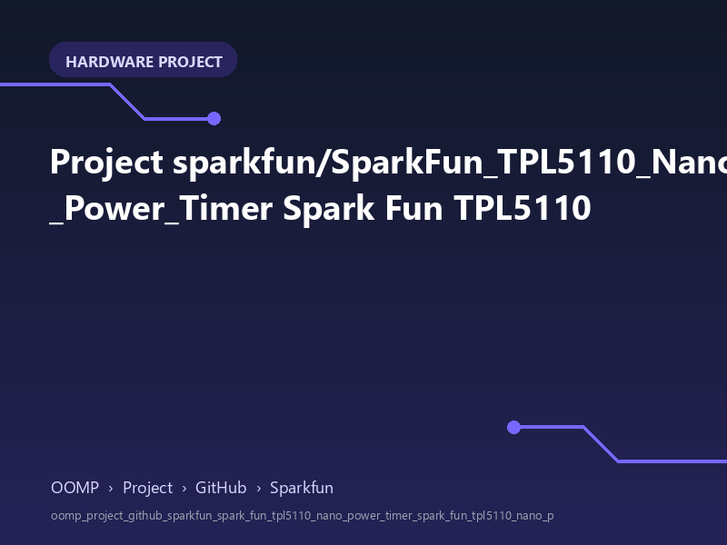

<!-- Generated item page. Full data lives in the source repository. -->
[Catalogue](../../../../../../../README.md) / [OOMP](../../../../../../README.md) / [Project](../../../../../README.md) / [GitHub](../../../../README.md) / [Sparkfun](../../../README.md) / [Spark Fun Tpl5110 Nano Power Timer](../../README.md) / [Spark Fun Tpl5110 Nano Power Switch](../README.md) / Current

# 🧭 Project sparkfun/SparkFun_TPL5110_Nano_Power_Timer Spark Fun TPL5110

> A concise OOMP hardware project organised under OOMP › Project › GitHub › Sparkfun.

**[Open board explorer ↗](https://oomlout.github.io/oomp_electronic_verison_5_pretty/catalogue/oomp/project/github/sparkfun/spark_fun_tpl5110_nano_power_timer/spark_fun_tpl5110_nano_power_switch/current/board_explorer.html)** · [Full details →](https://github.com/oomlout/oomp_electronic_version_5/tree/main/parts/oomp_project_github_sparkfun_spark_fun_tpl5110_nano_power_timer_spark_fun_tpl5110_nano_power_switch_current) · [Original project files](https://github.com/sparkfun/SparkFun_TPL5110_Nano_Power_Timer/blob/master/Hardware/SparkFun_TPL5110_Nano_Power_Switch.brd)

## At a glance

| Detail | Value |
| --- | --- |
| Owner | sparkfun |
| Repository | SparkFun_TPL5110_Nano_Power_Timer |
| Board | Spark Fun TPL5110 Nano Power Switch |
| Source format | eagle |
| Version | current |
| Git ref | master |
| OOMP ID | `oomp_project_github_sparkfun_spark_fun_tpl5110_nano_power_timer_spark_fun_tpl5110_nano_power_switch_current` |

## Catalogue location

`OOMP › Project › GitHub › Sparkfun › Spark Fun Tpl5110 Nano Power Timer › Spark Fun Tpl5110 Nano Power Switch › Current`

## About this page

This is the compact catalogue view. This index entry was built directly from its working metadata. The [board explorer page](https://oomlout.github.io/oomp_electronic_verison_5_pretty/catalogue/oomp/project/github/sparkfun/spark_fun_tpl5110_nano_power_timer/spark_fun_tpl5110_nano_power_switch/current/board_explorer.html) currently shows the project preview and source links; interactive board geometry will appear after the source project has been processed. Schematics, fabrication data, working metadata, alternate diagrams, availability data, and project analysis stay with the [full original record](https://github.com/oomlout/oomp_electronic_version_5/tree/main/parts/oomp_project_github_sparkfun_spark_fun_tpl5110_nano_power_timer_spark_fun_tpl5110_nano_power_switch_current).

---

[↑ Parent category](../README.md) · [Catalogue home](../../../../../../../README.md)
