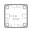

<!-- Generated item page. Full data lives in the source repository. -->
[Catalogue](../../../../../../../README.md) / [OOMP](../../../../../../README.md) / [Project](../../../../../README.md) / [GitHub](../../../../README.md) / [Sparkfun](../../../README.md) / [Spark Fun Triple Axis Acclerometer Lis3 Dh](../../README.md) / [Lis3dh Qwiic 1x1](../README.md) / Current

# 🧭 Project sparkfun/SparkFun_Triple_Axis_Acclerometer-LIS3DH LIS3DH Qwiic

> Project sparkfun/SparkFun_Triple_Axis_Acclerometer-LIS3DH LIS3DH Qwiic 1x1 current is a KiCad project containing 81 extracted component records. The catalogue matcher linked 18 physical placements to OOMP parts.

**[Full details →](https://github.com/oomlout/oomp_electronic_version_5/tree/main/parts/oomp_project_github_sparkfun_spark_fun_triple_axis_acclerometer_lis3_dh_lis3dh_qwiic_1x1_current)** · [Original project files](https://github.com/sparkfun/SparkFun_Triple_Axis_Acclerometer-LIS3DH/tree/main/Hardware/Qwiic%201x1)

## At a glance

| Detail | Value |
| --- | --- |
| Components | 81 |
| PCB footprints | 67 |
| Mounting and locating holes | 4 |
| Matched OOMP mounting-hole items | 4 |
| Schematic symbols | 45 |
| Matched OOMP components | 18 |
| Unmatched physical components | 0 |
| Front-side placements | 14 |
| Back-side placements | 0 |
| Project version | current |
| Git ref | main |
| OOMP ID | `oomp_project_github_sparkfun_spark_fun_triple_axis_acclerometer_lis3_dh_lis3dh_qwiic_1x1_current` |

## Catalogue location

`OOMP › Project › GitHub › Sparkfun › Spark Fun Triple Axis Acclerometer Lis3 Dh › Lis3dh Qwiic 1x1 › Current`

## About this page

This is the compact catalogue view. A detailed source README is available. Schematics, fabrication data, working metadata, alternate diagrams, availability data, and project analysis stay with the [full original record](https://github.com/oomlout/oomp_electronic_version_5/tree/main/parts/oomp_project_github_sparkfun_spark_fun_triple_axis_acclerometer_lis3_dh_lis3dh_qwiic_1x1_current).

---

[↑ Parent category](../README.md) · [Catalogue home](../../../../../../../README.md)
