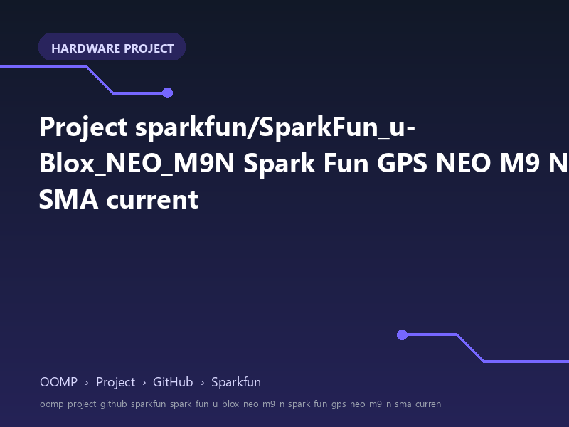

<!-- Generated item page. Full data lives in the source repository. -->
[Catalogue](../../../../../../../README.md) / [OOMP](../../../../../../README.md) / [Project](../../../../../README.md) / [GitHub](../../../../README.md) / [Sparkfun](../../../README.md) / [Spark Fun U Blox Neo M9 N](../../README.md) / [Spark Fun Gps Neo M9 N Sma](../README.md) / Current

# 🧭 Project sparkfun/SparkFun_u-Blox_NEO_M9N Spark Fun GPS NEO M9 N SMA current

> A concise OOMP hardware project organised under OOMP › Project › GitHub › Sparkfun.

**[Open board explorer ↗](https://oomlout.github.io/oomp_electronic_verison_5_pretty/catalogue/oomp/project/github/sparkfun/spark_fun_u_blox_neo_m9_n/spark_fun_gps_neo_m9_n_sma/current/board_explorer.html)** · [Full details →](https://github.com/oomlout/oomp_electronic_version_5/tree/main/parts/oomp_project_github_sparkfun_spark_fun_u_blox_neo_m9_n_spark_fun_gps_neo_m9_n_sma_current) · [Original project files](https://github.com/sparkfun/SparkFun_u-Blox_NEO_M9N/blob/master/Hardware/SparkFun%20GPS%20NEO_M9N_SMA/SparkFun%20GPS%20NEO_M9N_SMA.brd)

## At a glance

| Detail | Value |
| --- | --- |
| Owner | sparkfun |
| Repository | SparkFun_u-Blox_NEO_M9N |
| Board | Spark Fun GPS NEO M9 N SMA |
| Source format | eagle |
| Version | current |
| Git ref | master |
| OOMP ID | `oomp_project_github_sparkfun_spark_fun_u_blox_neo_m9_n_spark_fun_gps_neo_m9_n_sma_current` |

## Catalogue location

`OOMP › Project › GitHub › Sparkfun › Spark Fun U Blox Neo M9 N › Spark Fun Gps Neo M9 N Sma › Current`

## About this page

This is the compact catalogue view. This index entry was built directly from its working metadata. The [board explorer page](https://oomlout.github.io/oomp_electronic_verison_5_pretty/catalogue/oomp/project/github/sparkfun/spark_fun_u_blox_neo_m9_n/spark_fun_gps_neo_m9_n_sma/current/board_explorer.html) currently shows the project preview and source links; interactive board geometry will appear after the source project has been processed. Schematics, fabrication data, working metadata, alternate diagrams, availability data, and project analysis stay with the [full original record](https://github.com/oomlout/oomp_electronic_version_5/tree/main/parts/oomp_project_github_sparkfun_spark_fun_u_blox_neo_m9_n_spark_fun_gps_neo_m9_n_sma_current).

---

[↑ Parent category](../README.md) · [Catalogue home](../../../../../../../README.md)
