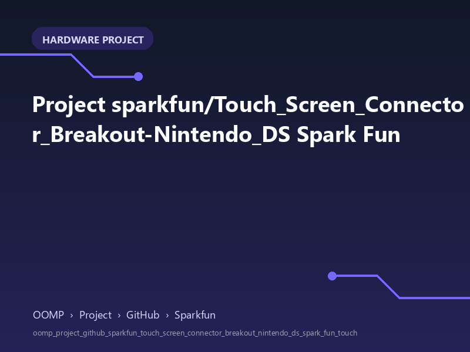

<!-- Generated item page. Full data lives in the source repository. -->
[Catalogue](../../../../../../../README.md) / [OOMP](../../../../../../README.md) / [Project](../../../../../README.md) / [GitHub](../../../../README.md) / [Sparkfun](../../../README.md) / [Touch Screen Connector Breakout Nintendo Ds](../../README.md) / [Spark Fun Touch Screen Connector Breakout Ds](../README.md) / Current

# 🧭 Project sparkfun/Touch_Screen_Connector_Breakout-Nintendo_DS Spark Fun

> A concise OOMP hardware project organised under OOMP › Project › GitHub › Sparkfun.

**[Open board explorer ↗](https://oomlout.github.io/oomp_electronic_verison_5_pretty/catalogue/oomp/project/github/sparkfun/touch_screen_connector_breakout_nintendo_ds/spark_fun_touch_screen_connector_breakout_ds/current/board_explorer.html)** · [Full details →](https://github.com/oomlout/oomp_electronic_version_5/tree/main/parts/oomp_project_github_sparkfun_touch_screen_connector_breakout_nintendo_ds_spark_fun_touch_screen_connector_breakout_ds_current) · [Original project files](https://github.com/sparkfun/Touch_Screen_Connector_Breakout-Nintendo_DS/blob/master/Hardware/SparkFun_Touch_Screen_Connector_Breakout_DS.brd)

## At a glance

| Detail | Value |
| --- | --- |
| Owner | sparkfun |
| Repository | Touch_Screen_Connector_Breakout-Nintendo_DS |
| Board | Spark Fun Touch Screen Connector Breakout DS |
| Source format | eagle |
| Version | current |
| Git ref | master |
| OOMP ID | `oomp_project_github_sparkfun_touch_screen_connector_breakout_nintendo_ds_spark_fun_touch_screen_connector_breakout_ds_current` |

## Catalogue location

`OOMP › Project › GitHub › Sparkfun › Touch Screen Connector Breakout Nintendo Ds › Spark Fun Touch Screen Connector Breakout Ds › Current`

## About this page

This is the compact catalogue view. This index entry was built directly from its working metadata. The [board explorer page](https://oomlout.github.io/oomp_electronic_verison_5_pretty/catalogue/oomp/project/github/sparkfun/touch_screen_connector_breakout_nintendo_ds/spark_fun_touch_screen_connector_breakout_ds/current/board_explorer.html) currently shows the project preview and source links; interactive board geometry will appear after the source project has been processed. Schematics, fabrication data, working metadata, alternate diagrams, availability data, and project analysis stay with the [full original record](https://github.com/oomlout/oomp_electronic_version_5/tree/main/parts/oomp_project_github_sparkfun_touch_screen_connector_breakout_nintendo_ds_spark_fun_touch_screen_connector_breakout_ds_current).

---

[↑ Parent category](../README.md) · [Catalogue home](../../../../../../../README.md)
